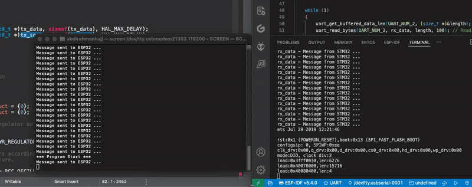
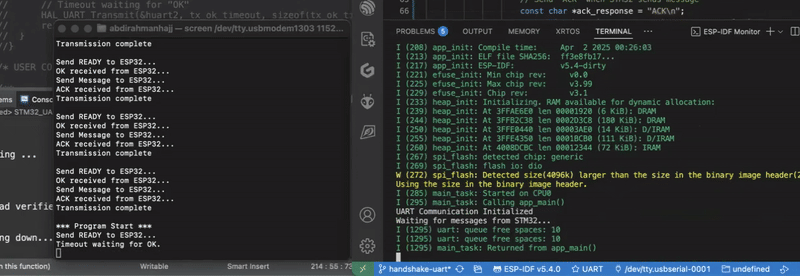

### STM32-ESP32 UART Communication
This project establishes a UART-based communication link between STM32 and ESP32 boards, implementing a handshake protocol for reliable data transmission.

### Approach 1: Basic UART Communication
This approach involves simple UART transmission where the STM32 sends data, and the ESP32 receives it directly.

Limitations:
- Polling-based approach increases computational overhead due to constant status checks.
- No acknowledgment mechanism, meaning data may be lost if the receiver is not ready.
- Inefficient CPU usage as both devices are continuously checking for new data.

### Approach 2: Interrupt-Driven Handshake 
This approach enhances reliability by implementing a timeout-based handshake to coordinate data transfer between STM32 and ESP32.

Handshake Sequence:
1. STM32 sends `READY` to ESP32.
2. ESP32 responds with `OK` upon receiving READY.
3. STM32 sends data to ESP32.
4. ESP32 acknowledges receipt with `ACK`.
5. STM32 confirms completion, ensuring reliable transmission.

#### Tools & Software Used
STM32 Development:
 - STM32CubeIDE (with HAL for configuration)
 - ST-Link Debugger

ESP32 Development:
 - ESP-IDF
 - VS Code (with UART Debugging)

Hardware:
 - STM32 MCU
 - ESP32 MCU

#### Example Communication:
```
STM32:  Send READY to ESP32...           ESP32:  Received: READY?
        OK received from ESP32...                Responded with: OK
        Send Message to ESP32...                 Received: Message from STM32
        ACK received from ESP32...               Responded with: ACK
        Transmission complete
```

#### Demo
Basic UART
 

Handshake UART
 
